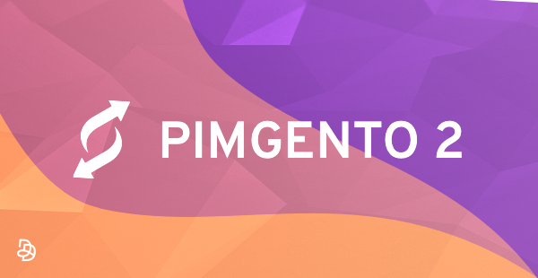

# PIMGento2 (API)

PIMGento2 (API) is a Magento 2 extension that allows you to import your catalog from Akeneo API into Magento.

You can discover PIMGento2 (API) on the [official website](https://www.pimgento.com/).

> The [first version](https://github.com/Agence-DnD/PIMGento-2) of the PIMGento2 connector will not be maintained anymore by the end of 2018.

### Documentation

PIMGento2 (API) complete documentation is available [here](doc/summary.md).
Akeneo API complete documentation is available [here](https://api.akeneo.com/).

### How it works

PIMGento2 (API) fetches data from Akeneo API and insert data directly in Magento database.

In this way, it makes imports very fast and doesn't disturb your e-commerce website.

With PIMGento2 (API), you can import :
* Categories
* Families
* Attributes
* Options
* Product Model (Akeneo >= 2.0)
* Family Variant (Akeneo >= 2.0)
* Products
* Assets (Magento EE & Akeneo >= 2.0)

### Requirements

* Akeneo PIM >= 2.0 (CE & EE)
* Magento >= 2.1 (CE & EE)
* Database encoding must be UTF-8

### Installation, Configuration and Usage

If you want to know how to install, configure or use PIMGento2 (API), please check [how to...](doc/important_stuff/how_to.md) section. We advise you to start here!
If you want to migrate from the PIMGento2 CSV connector to this one, please follow our [migration guide](doc/important_stuff/migration_guide.md).

### Roadmap

You can consult our roadmap [here](doc/important_stuff/roadmap.md).

### About us

Founded by lovers of innovation and design, [Agence Dn'D](https://www.dnd.fr) assists companies in the creation and development of customized digital (open source) solutions for web and E-commerce since 2004.
